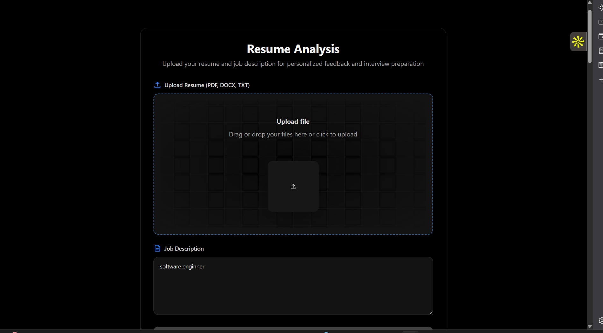
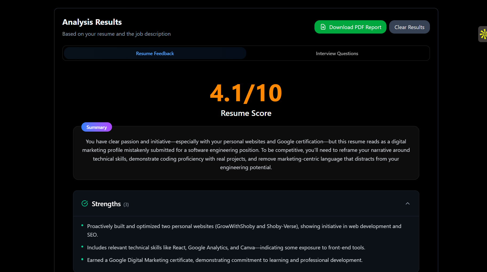
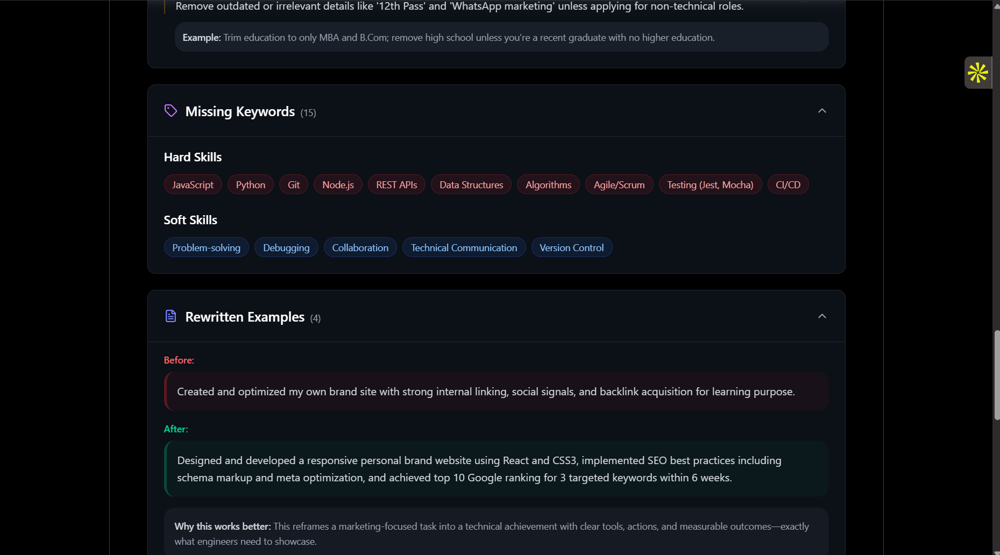
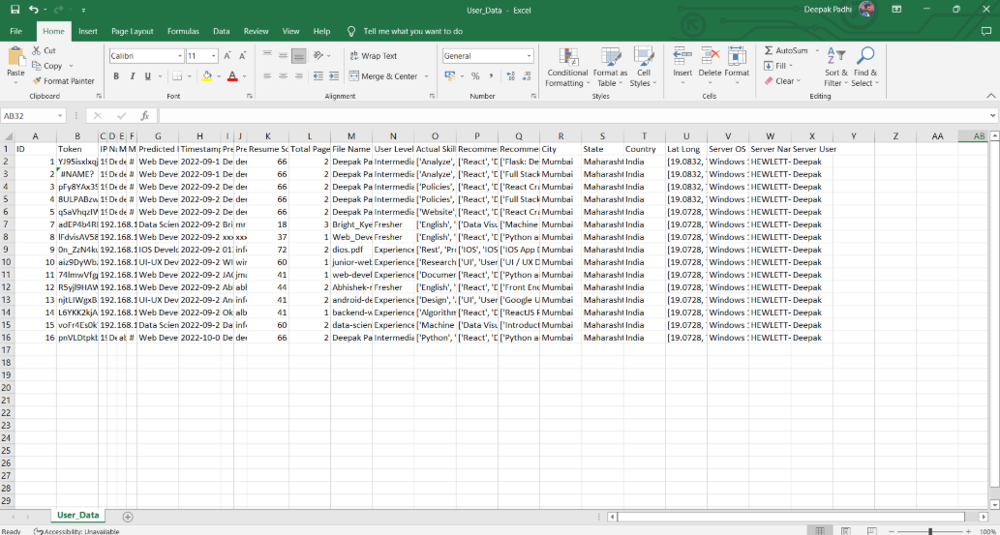

# 🤖 ResumeX

ResumeX is your personal AI-powered interview and feedback assistant.  
It analyzes your **resume** and **job description (JD)** to generate:  
- 📋 Detailed feedback  
- 🎯 Personalized interview questions  
- 💡 Insights to help you prepare better  

Built with **Next.js** and powered by **Hugging Face models**.  

---

## 🚀 Getting Started

Follow these steps to set up ResumeX locally:

### Preview 









### 1. Clone the Repository
```
git clone https://github.com/priyanshuyadav/daddy-ai
cd daddy-ai
```

### 2. Install Dependencies

```
npm install
# or
yarn install
# or
pnpm install
# or
bun install
```

# Required Hugging Face token
```
HF_TOKEN=your_huggingface_access_token_here
```

# Optional tokens for specialized use
```
HF_TOKEN_FEEDBACK=your_optional_feedback_token_here
HF_TOKEN_QUESTIONS=your_optional_questions_token_here
```

### 3. Run Development Server
```
npm run dev
# or
yarn dev
# or
pnpm dev
# or
bun dev
```

# resumeanalyser
# resumex
